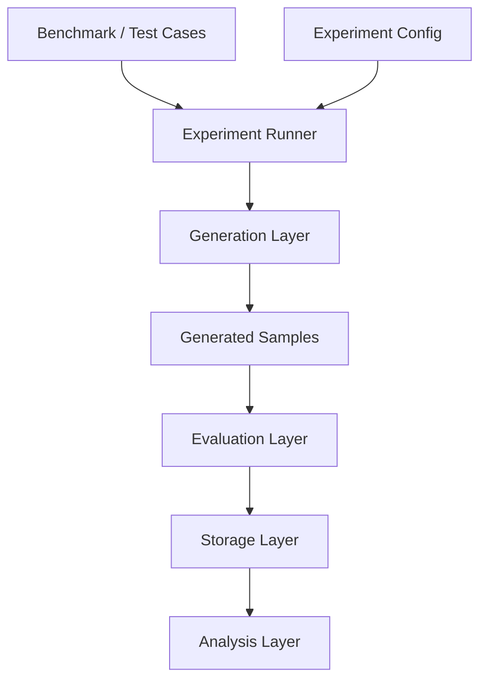

# System Design — Component Relationships

## High-Level Architecture



---

# Core Components

| Component | Purpose |
|---|---|
| Benchmark/Test Cases | Defines WHAT is tested |
| Experiment Config | Defines HOW it is tested |
| Generation Layer | Produces sentence samples |
| Evaluation Layer | Scores generated outputs |
| Storage Layer | Stores experiments, outputs, metrics |
| Analysis Layer | Compares methods and results |

---

# Relationships Between Components

## Benchmark → Test Cases
One benchmark contains many test cases.

Example:
- comer + past + 1pl
- vivir + future + 3sg

---

## Experiment Config → Generation
One experiment defines:
- generation method,
- decoding settings,
- evaluation setup.

Example:
```yaml
method: constrained_decoding
samples_per_case: 50
```

---

## Generation → Outputs
One test case generates many outputs.

Relationship:
```text
1 test case -> N generated samples
```

Example:
```text
comer + past + 50 generations
```

---

## Evaluation Relationship
Evaluation operates at two levels:

### Per-Sample Evaluation
Each generated sentence is scored individually.

Example:
- grammar correctness,
- fluency,
- diversity.

### Aggregate Evaluation
Metrics are averaged across all samples and test cases.

Example:
- average grammar accuracy,
- average diversity.

---

## Storage Relationship
Storage centralises:
- experiment configs,
- generated outputs,
- evaluation metrics.

Relationship:
```text
1 experiment -> many outputs -> many metrics
```

---

## Analysis Relationship
Analysis queries stored results only.

Examples:
- compare methods,
- diversity vs accuracy,
- error analysis.

---

# Modularity Principle

Each layer communicates only through standardised experiment records.

Example:

```json
{
  "experiment_id": "exp_001",
  "input": {
    "keyword": "comer",
    "tense": "past"
  },
  "output": "Nosotros comimos pizza.",
  "metrics": {
    "grammar": 0.92,
    "diversity": 0.71
  }
}
```

This allows:
- swapping generation methods,
- swapping evaluators,
- reusing benchmarks,
- reproducible experiments.

---

# Experiment Structure

```text
For each experiment:
    For each test case:
        Generate N samples
        Evaluate samples
Aggregate metrics
Compare methods
```

