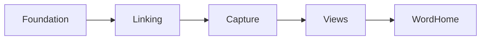
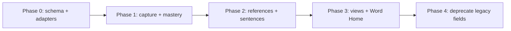

# Implementation Spec: Word-First Foundation

> Status: Draft v0.1
> Branch: `feat/word-first-foundation`
> Companion: [docs/product_direction.md](product_direction.md)
> Scope: detailed engineering plan for the selected LOS tickets only.

---

## 1. Scope

This spec is **only** for the following tickets from
[docs/product_direction.md](product_direction.md):

| Ticket | Title | Group |
| --- | --- | --- |
| LOS-101 | Canonical Word schema | A. Foundations |
| LOS-106 | Word Capture UX contract | A. Foundations |
| LOS-107 | Lemma/surface preference mode | A. Foundations |
| LOS-901 | Per-atom mastery tracking | A. Foundations |
| LOS-104 | Inline word reference (synced-block analogue) | B. References + Sentences |
| LOS-501 | Sentence object linked to atoms | B. References + Sentences |
| LOS-502 | Sentence generation tied to lexicon | B. References + Sentences |
| LOS-401 | Quick Capture modal + global shortcut | C. Capture |
| LOS-402 | Quick capture from selection | C. Capture |
| LOS-301 | Lexicon table view with filters | D. Views + Word Home |
| LOS-302 | Flashcard view (sourced from same query) | D. Views + Word Home |
| LOS-102 | Word Home page | D. Views + Word Home |

Out of scope here: phrases, packs, mistake inbox, scene builder, usage graph,
pronunciation, LLM editor.

### Non-negotiable guardrails

- `frontend/app/learn/flashcards/page.tsx` keeps **all** existing controls,
  shortcuts, session flow, and visual treatment. We add an adapter layer
  underneath; we do not rewrite the UI.
- All schema changes are **additive and nullable** in the first pass. No drops,
  no renames, no required-field changes until backfill is verified.
- Existing `word`, `translation`, `tags`, `learned`, `created_at` semantics
  remain valid throughout the migration window.

### Sequencing



1. Foundation: 101, 106, 107, 901
2. Linking: 104, 501, 502
3. Capture: 401, 402
4. Views: 301, 302
5. Word Home: 102

Each phase ships behind compatibility adapters; nothing user-visible breaks
between phases.

---

## 2. Foundations: 101, 106, 107, 901

This is the data-model spine. Everything downstream depends on it.

### 2.1 Canonical Word schema (LOS-101)

Source of truth: backend `Vocab` table in
[backend/app/db/models.py](../backend/app/db/models.py).
Today it has: `id`, `workspace_id`, `word`, `translation`, `tags`, `learned`,
`created_at`.

**Additive fields (all nullable / default-backed):**

| Field | Type | Notes |
| --- | --- | --- |
| `lemma` | `String(255)` | dictionary form. Backfilled from `word` initially. |
| `surface_form` | `String(255)` | first encountered form. Backfilled from `word`. |
| `surface_forms` | `JSON` (list of strings) | history of seen forms; default `[]`. |
| `pos` | `String(32)` | nullable; mirrors first tag if present, else null. |
| `cefr` | `String(8)` | nullable, e.g. `A1`..`C2`. |
| `frequency_rank` | `Integer` | nullable; corpus rank when known. |
| `gender` | `String(8)` | nullable, e.g. `m`/`f`/`n`. |
| `conjugation_class` | `String(32)` | nullable, e.g. `ar`/`er`/`ir` for Spanish. |
| `morph_features` | `JSON` (object) | nullable; UD-style key/values. |
| `ipa` | `String(128)` | nullable phonetic transcription. |
| `audio_url` | `String(512)` | nullable. |
| `image_url` | `String(512)` | nullable. |
| `gloss_primary` | `String(255)` | nullable; canonical short translation. Backfilled from `translation`. |
| `glosses` | `JSON` (list of strings) | nullable; alternative translations. |
| `notes` | `Text` | nullable freeform notes. |
| `last_seen_at` | `DateTime` | nullable. |

**Why not rename `word` -> `surface_form` immediately:** every consumer
(frontend storage, flashcards, sentences, generate API, seed) references
`word` and `translation`. We dual-write for one phase, then deprecate.

**Index additions:** `(workspace_id, lemma)` to support lemma-grouped queries.

**Migration step (manual SQL on first run via existing `Base.metadata.create_all`):**
- For each existing `Vocab` row: set `lemma = word`, `surface_form = word`,
  `surface_forms = [word]`, `gloss_primary = translation`,
  `pos = first(tags) if tags else null`. Idempotent.
- Implementation goes alongside the existing seed bootstrap in
  [backend/app/db/seed.py](../backend/app/db/seed.py) (new function
  `backfill_canonical_word_fields()` called from startup after table create).

**Pydantic schema changes** in
[backend/app/db/schemas.py](../backend/app/db/schemas.py):

- `VocabOut`: include all new fields, all `Optional[...]` except the existing
  required ones.
- `VocabCreate`: see LOS-106 below — `word`/`translation` become optional in
  favor of `surface_form`.
- `VocabUpdate`: extend with optional patch for every new field.

**Frontend type changes** in
[frontend/lib/types.ts](../frontend/lib/types.ts):

```ts
export interface VocabItem {
  id: number;
  workspaceId: number;
  word: string;            // legacy mirror of surface_form
  translation: string;     // legacy mirror of gloss_primary
  language: LanguageCode;
  tags: VocabTag[];
  learned: boolean;
  createdAt: number;

  // Canonical (LOS-101)
  lemma: string;
  surfaceForm: string;
  surfaceForms: string[];
  pos: string | null;
  cefr: string | null;
  frequencyRank: number | null;
  gender: string | null;
  conjugationClass: string | null;
  morphFeatures: Record<string, unknown> | null;
  ipa: string | null;
  audioUrl: string | null;
  imageUrl: string | null;
  glossPrimary: string | null;
  glosses: string[];
  notes: string | null;
  lastSeenAt: number | null;

  // Mastery (LOS-901), see 2.4
  mastery: MasteryState;
}
```

API ↔ frontend mapping is centralized in
[frontend/lib/api.ts](../frontend/lib/api.ts) `toVocab()` so the rest of the
app keeps using the same `VocabItem` shape.

### 2.2 Word Capture UX contract (LOS-106)

Goal: capture in under 3 seconds with only `surface_form`. Translation, POS,
tags, notes are all optional. Enrichment is async and reversible.

**Backend:**

- `VocabCreate` becomes:

```python
class VocabCreate(BaseModel):
    workspace_id: int
    surface_form: str = Field(min_length=1, max_length=255)
    lemma: str | None = None
    pos: str | None = None
    gloss_primary: str | None = None
    glosses: list[str] | None = None
    tags: list[VocabTag] = Field(default_factory=list)
    notes: str | None = None
```

- Server fills `lemma = surface_form` and `surface_forms = [surface_form]` if
  not provided.
- Server sets `gloss_primary = ""` (empty string, not null) so legacy
  `translation` mirroring stays string-typed.
- Legacy compatibility: if a client still POSTs `{ word, translation }`, the
  router accepts that shape and rewrites it to `surface_form`/`gloss_primary`
  before persistence. Implemented by accepting a discriminated union or a
  pre-validator. Lives in [backend/app/api/vocab.py](../backend/app/api/vocab.py).

**Enrichment queue (additive table):**

```python
class EnrichmentJob(Base):
    __tablename__ = "enrichment_jobs"
    id: Mapped[int] = mapped_column(primary_key=True, autoincrement=True)
    vocab_id: Mapped[int] = mapped_column(ForeignKey("vocab.id"), index=True)
    status: Mapped[str] = mapped_column(String(16), default="pending")  # pending|done|failed
    requested_fields: Mapped[list[str]] = mapped_column(JSON, default=list)
    result: Mapped[dict | None] = mapped_column(JSON, nullable=True)
    confidence: Mapped[float | None] = mapped_column(nullable=True)
    created_at: Mapped[datetime] = mapped_column(default=datetime.utcnow)
    completed_at: Mapped[datetime | None] = mapped_column(nullable=True)
```

- New endpoint `POST /api/vocab/{id}/enrich` enqueues a job.
- Worker stub in `backend/app/services/enrichment.py` (new file): for now,
  synchronous stub that sets `status=done` with empty result; LLM/NLP wired in
  later. Important: the **interface** is what we ship in this phase, not the
  intelligence behind it.
- Confidence policy: when `confidence >= 0.85`, server applies result fields
  directly. When lower, result is stored on the job for the user to confirm
  via `POST /api/vocab/{id}/enrich/{job_id}/accept|reject`.

**Frontend:**

- `addVocab` in [frontend/lib/storage.ts](../frontend/lib/storage.ts) accepts
  a relaxed input: `{ surfaceForm: string; glossPrimary?: string; tags?: VocabTag[] }`.
- Existing `{ word, translation, tags }` callers are wrapped in a thin adapter
  that maps to the new shape so [frontend/app/words/page.tsx](../frontend/app/words/page.tsx)
  and the import flow keep working unchanged.
- After save, frontend fires-and-forgets `enrichVocab(id)` and displays a
  small "enriching…" badge that clears when the job is done.

**Acceptance:**

- Adding a word from the words page or quick capture (LOS-401) succeeds with
  only `surface_form` filled.
- No modal blocks until POS/CEFR/tags are selected.
- Median time from CTA click to "saved" toast under 3s on local dev.

### 2.3 Lemma/surface preference mode (LOS-107)

Single user-level preference, stored alongside other settings.

**Backend (optional this phase):** add `display_preference` to a new
`UserSettings` row, or carry it client-side only. Recommendation:
**client-side only for now** (stored in localStorage), since we don't have
auth yet.

**Frontend:**

- Extend `Profile` in [frontend/lib/types.ts](../frontend/lib/types.ts):

```ts
export type WordDisplayMode = "lemma_first" | "as_encountered";

export interface Profile {
  name: string;
  wordDisplayMode: WordDisplayMode; // default "as_encountered"
}
```

- Add helper `formatWordDisplay(item, mode)` in
  [frontend/lib/storage.ts](../frontend/lib/storage.ts) returning
  `{ primary, secondary }`. `primary` is what the header/cards render;
  `secondary` is the counterpart form.
- All vocab-displaying surfaces (words page card title, flashcards front,
  sentences header, future Word Home) consume `formatWordDisplay`.

**Acceptance:**

- Toggling preference flips display across all surfaces immediately.
- Internally, both `lemma` and `surface_form` are still stored regardless of
  preference.

### 2.4 Per-atom mastery tracking (LOS-901)

Mastery is one struct per word, used by views, queues, flashcards, sentences.

**Backend table (additive):**

```python
class WordMastery(Base):
    __tablename__ = "word_mastery"
    __table_args__ = (Index("ix_mastery_workspace_due", "workspace_id", "next_due"),)

    id: Mapped[int] = mapped_column(primary_key=True, autoincrement=True)
    workspace_id: Mapped[int] = mapped_column(ForeignKey("workspaces.id"), index=True)
    vocab_id: Mapped[int] = mapped_column(ForeignKey("vocab.id"), unique=True, index=True)

    strength: Mapped[float] = mapped_column(default=0.0)        # 0..1
    box: Mapped[int] = mapped_column(default=0)                 # leitner-style bucket 0..5
    last_reviewed_at: Mapped[datetime | None] = mapped_column(nullable=True)
    next_due: Mapped[datetime | None] = mapped_column(nullable=True)
    streak: Mapped[int] = mapped_column(default=0)
    failures: Mapped[int] = mapped_column(default=0)
    successes: Mapped[int] = mapped_column(default=0)
```

- One row per `vocab_id` per workspace. Auto-created with defaults the first
  time a word is reviewed.
- Existing `Vocab.learned` boolean stays as a derived view: `box >= 4` or
  manual override. Setting `learned=true` via the existing PATCH endpoint
  also bumps `box` to 4 in the same transaction.

**Endpoint:** `POST /api/vocab/{id}/mastery/event` with body
`{ outcome: "correct" | "incorrect" | "skipped" | "hinted", source: string }`.
Updates strength/box using a simple deterministic rule for now:

| Outcome | Effect |
| --- | --- |
| correct | strength += 0.2 (cap 1.0); box += 1 (cap 5); streak += 1; successes += 1 |
| incorrect | strength = max(0, strength - 0.3); box = max(0, box - 1); streak = 0; failures += 1 |
| hinted | strength += 0.05 |
| skipped | no-op |

`next_due` is computed from `box` via a Leitner schedule (1d, 2d, 4d, 8d, 16d, 30d).

**Pydantic + frontend types:**

```ts
export interface MasteryState {
  strength: number;       // 0..1
  box: number;            // 0..5
  lastReviewedAt: number | null;
  nextDue: number | null;
  streak: number;
  failures: number;
  successes: number;
}
```

`VocabOut` includes a nested `mastery` object (joined-load on read).

**Frontend integration points (no UI yet, just wiring):**

- `useVocab().recordOutcome(vocabId, outcome, source)` calls the endpoint and
  optimistically updates local state.
- Flashcards "Knew it" / "Didn't know" -> `recordOutcome("correct" | "incorrect", "flashcards")`.
- Sentences correct/incorrect/skipped/hinted -> same call with `source: "sentences"`.
- Both happen **alongside** existing local stats — we do not remove the
  in-session counters; we only add server-side persistence.

**Acceptance:**

- Reviews from flashcards and sentences update the same `WordMastery` row.
- `learned` toggle in the words page still works and stays consistent with
  `box`.
- No regression in existing in-session stats UI.

---

## 3. References + Sentences: 104, 501, 502

### 3.1 Inline word reference (LOS-104)

Conceptually a "synced block" for words. Implementation is a thin pattern, not
a heavy framework.

**Type:**

```ts
export interface WordRef {
  vocabId: number;
  // optional UI-only override; never overrides lexical data
  display?: { compact?: boolean };
}
```

**Resolution helper** in [frontend/lib/storage.ts](../frontend/lib/storage.ts):

```ts
export function useWordRef(ref: WordRef): VocabItem | null {
  const { vocab } = useVocab();
  return useMemo(() => vocab.find((v) => v.id === ref.vocabId) ?? null,
    [vocab, ref.vocabId]);
}
```

**Component** `WordChip` in `frontend/components/WordChip.tsx` (new):

- Takes a `WordRef`, resolves via `useWordRef`, renders the word using
  `formatWordDisplay` (LOS-107), with hover state showing gloss.
- Click navigates to `/words/[id]` (Word Home, LOS-102).
- Single source of truth for any inline word display anywhere in the app.

**Where it's used in this phase:**

- Sentence rendering on the sentences page renders matching tokens as
  `WordChip` rather than plain text.
- Word Home backlinks list (LOS-102).

**Acceptance:**

- Editing a vocab item's `lemma`/`audio_url` updates rendering everywhere
  `WordChip` is mounted, with no page reload.
- No other component reads `vocab.word` or `vocab.translation` directly for
  display — they all go through `WordChip` or `formatWordDisplay`.

### 3.2 Sentence object linked to atoms (LOS-501)

Sentences become first-class persisted objects, not transient generation
results.

**Backend models:**

```python
class Sentence(Base):
    __tablename__ = "sentences"
    __table_args__ = (Index("ix_sentence_workspace", "workspace_id"),)

    id: Mapped[int] = mapped_column(primary_key=True, autoincrement=True)
    workspace_id: Mapped[int] = mapped_column(ForeignKey("workspaces.id"), index=True)
    text: Mapped[str] = mapped_column(Text, nullable=False)
    translation: Mapped[str | None] = mapped_column(Text, nullable=True)
    language: Mapped[str] = mapped_column(String(16), nullable=False)
    source: Mapped[str] = mapped_column(String(32), default="generated")  # generated|manual|imported|mistake
    source_meta: Mapped[dict | None] = mapped_column(JSON, nullable=True)
    score: Mapped[float | None] = mapped_column(nullable=True)
    created_at: Mapped[datetime] = mapped_column(default=datetime.utcnow)


class SentenceWordLink(Base):
    __tablename__ = "sentence_word_links"
    __table_args__ = (Index("ix_link_sentence_position", "sentence_id", "position"),)

    id: Mapped[int] = mapped_column(primary_key=True, autoincrement=True)
    sentence_id: Mapped[int] = mapped_column(ForeignKey("sentences.id"), index=True)
    vocab_id: Mapped[int] = mapped_column(ForeignKey("vocab.id"), index=True)
    surface_token: Mapped[str] = mapped_column(String(255))
    position: Mapped[int]                       # token index in source text
    role: Mapped[str] = mapped_column(String(16), default="target")  # target|context|distractor
```

**Why a join table rather than `JSON` of refs:** lets us answer "show all
sentences that link to word N" with a single index, which Word Home backlinks
(LOS-102) needs.

**API additions in [backend/app/api](../backend/app/api):**

- `POST /api/sentences` — create with `{ text, translation?, language, source, links: [{ vocab_id, surface_token, position, role }] }`
- `GET /api/sentences?workspace_id=...&vocab_id=...` — list, optionally filtered
- `GET /api/sentences/{id}`
- `DELETE /api/sentences/{id}`

**Generation hookup:** when `/api/generate` returns candidates, the frontend
(or the endpoint itself, decided per the question below) persists them via
`POST /api/sentences` with `source="generated"` and `source_meta` capturing
the original generation request. The current `SentenceCandidate` shape stays
backwards compatible.

**Open decision (will pick before implementation):** persist on generate vs
persist on first use. Default proposal: **persist on first use** (when the
user actually practices the sentence) to avoid DB bloat from regenerations.
The current cache in `frontend/app/learn/sentences/page.tsx` is the
"speculative" tier; saved sentences are the "committed" tier.

**Frontend types:**

```ts
export interface SentenceLink {
  vocabId: number;
  surfaceToken: string;
  position: number;
  role: "target" | "context" | "distractor";
}

export interface Sentence {
  id: number;
  workspaceId: number;
  text: string;
  translation: string | null;
  language: LanguageCode;
  source: "generated" | "manual" | "imported" | "mistake";
  score: number | null;
  createdAt: number;
  links: SentenceLink[];
}
```

### 3.3 Constrained generation (LOS-502)

Generation can be told "use only words I know, plus N stretch words." This is
a request-shape change in the existing endpoint.

**Endpoint extension** in
[backend/app/api/generate.py](../backend/app/api/generate.py):

```python
class GenerateRequest(BaseModel):
    word: str
    translation: str
    tense: str = "present"
    person: str = "3rd"
    number: str = "singular"
    num_candidates: int = Field(default=3, ge=1, le=10)
    sentence_length: str | None = None
    direction: str | None = None

    # LOS-502
    lexicon_constraint: Literal["off", "known_only", "known_plus_stretch"] = "off"
    workspace_id: int | None = None
    stretch_count: int = 0
    extra_allowed_vocab_ids: list[int] = Field(default_factory=list)
```

When `lexicon_constraint != "off"` and `workspace_id` is provided:

- Server queries the workspace's vocab list (filtered by `learned=true` for
  `known_only`, plus `stretch_count` random "almost known" words for
  `known_plus_stretch`).
- The list of allowed words/lemmas is injected into the LLM prompt as
  `Allowed vocabulary: ...`. A post-validation pass parses the candidate text
  with a simple tokenizer, checks every content word against the allowed
  list, and drops candidates that violate.
- If all candidates are dropped, fall back to standard generation and mark
  `mock=false, constrained=false` in the response so the UI can show a
  warning.

**Response extension:**

```python
class GenerateResponse(BaseModel):
    candidates: list[Candidate]
    mock: bool = False
    constrained: bool = False
    used_vocab_ids: list[int] = Field(default_factory=list)
```

**Frontend wiring:** sentences page gains a "Constraint" control inside the
existing `SettingsPopover` with three options matching the enum. Default off
to preserve current behavior. When on, request includes the active
`workspace_id` from `useWorkspaces()`.

---

## 4. Capture + Views: 401, 402, 301, 302

### 4.1 Quick Capture modal (LOS-401)

Single global entrypoint, lives in the root layout so it's mountable from
any page.

**Component:** `frontend/components/QuickCapture.tsx` (new), rendered once in
`frontend/app/layout.tsx`.

- Opens via a global keyboard shortcut (`Cmd/Ctrl+K`) or a button in the
  Sidebar.
- Single field `Type word as encountered` plus optional `Meaning`.
- Submit calls `addVocab({ surfaceForm, glossPrimary? })`.
- On success: toast "Added `<word>` — enriching…" and trigger
  `enrichVocab(id)`.

**Hotkey handling:** centralized in a small `useGlobalShortcut` hook so we
don't sprinkle keydown listeners everywhere. Respects active text inputs.

**Acceptance:**

- Modal is reachable from any page including `/learn/flashcards` without
  navigating away.
- Keyboard shortcut works on macOS and Linux/Windows builds.
- Pressing Enter saves and closes.

### 4.2 Quick capture from selection (LOS-402)

Right-click / long-press / button affordance to convert a selection in any
text surface into a captured word, phrase, or sentence.

**MVP surfaces (Capture phase only):**

- Sentence prompt box on `frontend/app/learn/sentences/page.tsx`
- Generated sentence text on the same page
- Word Home examples (added in LOS-102)

**Mechanism:**

- A `SelectionCapture` provider component wraps any text we want to make
  selectable-capturable.
- On selection-change, a small floating action button appears with three
  options: "Add as word", "Add as phrase" (no-op for now, disabled with
  tooltip — phrases out of scope), "Add as sentence".
- Add as word -> opens QuickCapture pre-filled with the selection.
- Add as sentence -> calls `POST /api/sentences` with `source="manual"` and
  the surrounding context if available.

**Acceptance:**

- Selecting a token in a generated sentence and clicking "Add as word"
  creates the canonical word with the selection as `surface_form`.
- The action does not interfere with typing/answering on sentences page.

### 4.3 Lexicon table view with filters (LOS-301)

A new `/words?view=table` mode (or a dedicated `/lexicon` route — see
question below) backed by the same `useVocab()`.

**Recommended placement:** new top-level route `/lexicon`, leaving the
existing `/words` page (card grid) untouched for now to avoid visual
regressions. We migrate the cards UI to a "view" of the same data later if
needed.

**Filters (controlled state, URL-synced):**

- Search across `surface_form`, `lemma`, `gloss_primary`, `glosses`, `notes`
- POS multi-select
- CEFR multi-select
- Tag multi-select (existing)
- Mastery box range
- `nextDue` predicate (`due now`, `due this week`, `not due`)
- Source (where it was captured): manual, imported, mistake, generated
- Last reviewed in last N days

**Saved filters:** out of scope here (LOS-305 is not in this batch). URL
encoding is the persistence mechanism for now.

**Columns (default):** display word (per LOS-107), lemma, POS, CEFR, tags,
box, next due, last reviewed, created at, actions (open Word Home, open
flashcards filtered, open sentences filtered).

**Empty state:** prompt to add via QuickCapture.

### 4.4 Flashcard view sourced from same query (LOS-302)

This is the guardrail-heavy ticket. Key rule: do **not** modify the visual
or interaction behavior of
[frontend/app/learn/flashcards/page.tsx](../frontend/app/learn/flashcards/page.tsx).

**What we change:**

- Add a new optional URL param `filter` containing the same query string
  shape as the lexicon table view: `/learn/flashcards?filter=<encoded>`.
- Inside `FlashcardsInner`, after `vocab` is loaded, if `filter` is present
  apply the same filtering predicate used by the lexicon table view (shared
  helper `applyLexiconFilter(vocab, filter)` in `frontend/lib/lexicon-query.ts`,
  new file).
- Existing `?word=` single-word path stays unchanged and takes precedence.

**What we do not change:**

- Front/back rendering (still uses `current.translation` / `current.word`,
  with `formatWordDisplay` swapping in transparently).
- Knew it / Didn't know buttons (now also call `recordOutcome` from LOS-901,
  but the in-session UI stats are untouched).
- Keyboard shortcuts, timer, session summary, restart/reshuffle logic.
- Direction toggle (`en-to-es` vs `es-to-en`).

**Adapter layer for content:**

```ts
function flashcardFaces(item: VocabItem, direction: Direction, mode: WordDisplayMode) {
  const display = formatWordDisplay(item, mode);
  const front = direction === "en-to-es" ? item.glossPrimary || item.translation : display.primary;
  const back  = direction === "en-to-es" ? display.primary : item.glossPrimary || item.translation;
  return { front, back };
}
```

This adapter lives next to the page and is the only place that decides what
goes on each face. The rest of the page stays as-is.

**Acceptance:**

- All existing flashcards behaviors work identically with no filter.
- `?filter=...` constrains the deck to the same set the lexicon view shows.
- "Knew it" / "Didn't know" both write to `WordMastery` server-side and
  update the existing local session stats.

### 4.5 Word Home page (LOS-102)

Route: `/words/[id]`.

**Sections (top to bottom):**

1. Header: large display word per `formatWordDisplay`, audio button if
   `audio_url`, image if `image_url`, edit button.
2. Properties panel: lemma, POS, CEFR, gender, conjugation class, tags,
   frequency rank.
3. Translations: `gloss_primary` plus alternates from `glosses`.
4. Examples: list of `Sentence` objects whose `links[]` include this word
   (rendered with `WordChip` for in-text references — LOS-104).
5. Forms seen: `surface_forms` chronological list.
6. Mastery: strength, box, next due, streak, recent outcomes (last 10
   events).
7. Backlinks: total counts (sentences). Phrases/dialogues/mistakes are
   placeholders for now.
8. History: `created_at`, `last_seen_at`.

**Data fetching:** new `getWord(id)` API that returns the canonical row plus
nested `mastery` and a small page-1 of linked sentences. We can compose
existing endpoints initially: `GET /api/vocab/{id}` (extend with mastery
join) + `GET /api/sentences?vocab_id=...&limit=20`.

**Linking from existing UI:** every word card in `/words` and every chip in
sentence rendering links here.

**Acceptance:**

- Editing audio_url on Word Home is reflected in flashcards and sentences
  immediately on next render (LOS-104 guarantee).
- Empty states render cleanly when fields are null.

---

## 5. Validation + Rollout

### 5.1 Test matrix

**Backend (pytest):**

- `test_vocab_capture_minimal` — POST with only `surface_form` succeeds, all
  derived fields backfilled.
- `test_vocab_capture_legacy` — POST with `{ word, translation }` still works
  and is mirrored to `surface_form` / `gloss_primary`.
- `test_vocab_enrichment_job` — enqueue, complete, accept/reject paths.
- `test_word_mastery_event` — outcome rules update box/strength/next_due
  deterministically.
- `test_sentence_create_with_links` — links insert with correct positions and
  roles; `GET ...?vocab_id=` returns them.
- `test_generate_constrained` — when `lexicon_constraint="known_only"` and
  workspace has no learned words, response is `mock=true` or constrained=false
  with a warning shape.
- `test_generate_constrained_validates_candidates` — candidates containing
  out-of-vocab words are dropped.

**Frontend (Vitest + React Testing Library):**

- `formatWordDisplay` returns the right primary/secondary for both modes.
- `applyLexiconFilter` matches expected subsets for representative filter
  shapes.
- `flashcardFaces` adapter produces faces matching legacy behavior when no
  preference and no canonical fields set.
- QuickCapture modal opens via shortcut, submits with only `surfaceForm`,
  shows toast.

**Regression suite (manual checklist):**

1. `/words` page: add, edit, delete, toggle learned, import CSV, export CSV.
2. `/learn/flashcards` no-filter: shuffle, direction toggle, reveal,
   knew/didn't, restart, reshuffle, keyboard shortcuts, single-word `?word=`
   path.
3. `/learn/flashcards?filter=...`: deck respects filter; everything else
   identical.
4. `/learn/sentences` no-constraint: existing typing and multiple-choice
   modes work end-to-end.
5. `/learn/sentences` with `lexicon_constraint=known_only`: candidates only
   use words marked learned.
6. Workspace switcher still scopes vocab and sentences correctly.
7. `/words/[id]` Word Home renders for every existing seed word with no
   missing-field crashes.

**End-to-end smoke (Playwright, single happy path):**

- Cmd/Ctrl+K -> type `casa` -> save -> appears on `/words` -> open Word
  Home -> open flashcards filtered to that word -> "Knew it" -> Word Home
  shows incremented `successes`.

### 5.2 Rollout phases



- **Phase 0 — Foundation (PR 1):** schema additions, backfill, Pydantic +
  TypeScript type extensions, mastery table + event endpoint. No UI changes
  yet. All existing pages keep working unchanged.
- **Phase 1 — Capture + mastery wiring (PR 2):** `VocabCreate` accepts
  surface-only, enrichment job stub, QuickCapture modal, hooks for outcome
  events from flashcards and sentences. Existing flows untouched
  visually.
- **Phase 2 — References + sentences (PR 3):** `Sentence` + `SentenceWordLink`
  tables and endpoints, `WordChip` component, sentences page renders chips,
  constrained generation request shape. Default constraint stays "off".
- **Phase 3 — Views + Word Home (PR 4):** `/lexicon` route, flashcards
  `?filter=` support, `/words/[id]` Word Home, in-text selection capture.
- **Phase 4 — Deprecation (PR 5, future):** remove legacy `word`/`translation`
  reads from non-adapter code paths. Drop the dual-write path. Out of scope
  for this branch.

### 5.3 Compatibility adapter retirement criteria

The dual-shape (legacy `word`/`translation` <-> canonical
`surface_form`/`gloss_primary`) adapters stay until **all** of these are true:

1. No frontend component references `vocab.word` or `vocab.translation`
   directly outside `frontend/lib/api.ts` mappers and the flashcards adapter.
2. All existing tests (regression checklist 1–7) pass with the legacy fields
   deleted from `VocabItem`.
3. A grep across the repo for `\.word` and `\.translation` on
   `VocabItem`-typed values returns only the adapter file.
4. CSV import/export updated to read/write canonical field names with a
   compatibility header for the old format.
5. Backfill of canonical fields verified on the production-equivalent SQLite
   DB on at least one full run.

Only after all five hold do we proceed to Phase 4 in a separate PR.

### 5.4 Risks and mitigations

| Risk | Mitigation |
| --- | --- |
| Dual-write divergence (`word` vs `surface_form` drift) | Single mapper in `to_vocab()` server-side; assertion in tests that they match on every read until Phase 4. |
| Mastery event spam from flashcards rapid clicks | Debounce on the frontend (250ms) and idempotency key on the endpoint (vocab_id + outcome + timestamp bucket). |
| Constrained generation drops everything | Always fall back to unconstrained on empty result and surface a UI warning instead of a silent empty state. |
| Word Home crashes on partially backfilled rows | All sections null-safe; render skeletons for missing fields rather than throwing. |
| Quick capture hotkey collides with browser/OS shortcut | Configurable via settings, default `Cmd/Ctrl+K`, fallback button always present. |

---

## 6. Open Decisions To Resolve Before Coding

1. Persist generated sentences on generate vs on first use? (Default: on first use.)
2. `/lexicon` as new route vs adding `view=table` toggle to `/words`? (Default: new route, keep `/words` cards untouched.)
3. Display preference: server-side (`UserSettings` table) vs client-only? (Default: client-only this phase.)
4. Mastery rule: keep deterministic Leitner here, or wire SM-2/FSRS later? (Default: Leitner now; spike SM-2 in a separate PR.)
5. Selection-capture surfaces: only sentence text in Phase 2, or extend to flashcards back face too? (Default: sentence text only.)
