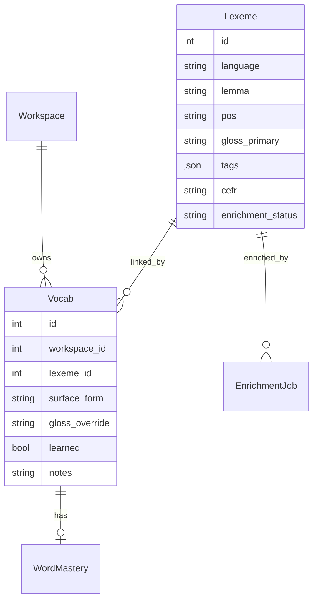

# Lexeme split + auto-tagging — design & implementation plan

> Branch: `feat/lexeme-split-auto-tagging` (from `origin/main`)  
> Strategy: one commit per phase, six phases total.

## Summary

Split the fat per-workspace `Vocab` row into:

- **`Lexeme`** — shared per-language dictionary (linguistic facts, enriched once)
- **`Vocab`** — thin workspace link (personal learning state)

Then wire **server-owned async enrichment** so every word is tagged reliably, with LLM work deduplicated across users.

**Order:** Lexeme split first (phases 1–4), auto-tagging second (phases 5–6). Enrichment targets `Lexeme`, not per-user copies.

---

## Target architecture



### Sense key (homonym disambiguation)

Unique on `Lexeme`:

```
(language, lemma_normalized, pos, gloss_primary_normalized)
```

- Normalize: lowercase, strip, collapse whitespace.
- `gloss_primary` anchors senses: `banco` + `bank` ≠ `banco` + `bench`.
- Empty gloss allowed at capture; enrichment fills gloss and may merge duplicates.

### Field ownership

| Field | Owner |
|---|---|
| `lemma`, `pos`, `tags`, `cefr`, `gender`, `conjugation_class`, `morph_features`, `ipa`, `glosses`, `audio_url`, `image_url`, `dictionary_notes` | `Lexeme` |
| `learned`, `notes`, `gloss_override`, `surface_form`, `surface_forms`, `last_seen_at` | `Vocab` |
| `word`, `translation` in API | Computed mirrors: `surface_form`, `gloss_override ?? lexeme.gloss_primary` |

### API contract

`VocabOut` stays **flat** — assembled by `vocab_mapper.vocab_out(vocab, lexeme)`. Frontend `VocabItem` shape unchanged.

---

## Phase 1 — Schema and models

**Commit message:** `feat: add Lexeme model and lexeme_id FK on Vocab`

### Files

- [`backend/app/db/models.py`](../backend/app/db/models.py)
- [`backend/app/db/migrate.py`](../backend/app/db/migrate.py)
- [`backend/app/db/schemas.py`](../backend/app/db/schemas.py)

### Changes

1. Add `Lexeme` table (see field list above + `enrichment_status`, `enriched_at`).
2. Add `Vocab.lexeme_id` FK (nullable during migration).
3. Add `Vocab.gloss_override`.
4. Update `EnrichmentJob`: add `lexeme_id` FK; make `vocab_id` nullable.
5. Keep deprecated linguistic columns on `Vocab` until phase 2 backfill completes.
6. `migrate.py`: `ensure_lexeme_columns()` — add `lexeme_id`, `gloss_override` to existing `vocab` table.
7. Pydantic: add `LexemeOut`, `LexemeEnrichmentStatus`; extend `EnrichmentJobOut` with `lexeme_id`.

### Acceptance

- `create_all` + `migrate.py` run cleanly on fresh and existing SQLite DBs.
- Existing API still works (deprecated columns untouched).

---

## Phase 2 — Data migration and seed

**Commit message:** `feat: backfill lexemes from vocab and update seed`

### Files

- New [`backend/app/db/backfill_lexemes.py`](../backend/app/db/backfill_lexemes.py)
- [`backend/app/db/seed.py`](../backend/app/db/seed.py)
- [`backend/app/db/migrate.py`](../backend/app/db/migrate.py)
- [`backend/app/main.py`](../backend/app/main.py)

### `backfill_lexemes()`

For each `Vocab` row without `lexeme_id`:

1. Load `workspace.language`.
2. `find_or_create_lexeme(language, lemma or surface_form or word, pos or tags[0] or "other", gloss_primary or translation)`.
3. Copy linguistic fields from deprecated `Vocab` columns → `Lexeme`.
4. Set `vocab.lexeme_id`.
5. Set `enrichment_status = "complete"` if lexeme passes completeness check, else `"pending"`.

**Dedup:** rows in different workspaces with same sense key share one `Lexeme`.

### Seed update

`ensure_default_workspace_and_vocab()`:

1. Create/find `Lexeme` per seed entry.
2. Create thin `Vocab` link only.

### Column cleanup

`migrate.py`: `drop_deprecated_vocab_columns()` — remove `lemma`, `pos`, `tags`, `cefr`, etc. from `vocab` table (SQLite 3.35+ `DROP COLUMN`).

Remove deprecated fields from `Vocab` SQLAlchemy model.

### Startup hook

```python
backfill_lexemes()
```

### Acceptance

- All seed vocab readable via API with same flat `VocabOut`.
- `lexemes` row count << duplicated field storage.

---

## Phase 3 — Service layer and CRUD refactor

**Commit message:** `feat: refactor vocab CRUD to use Lexeme resolver and mapper`

### New files

- [`backend/app/services/lexeme_resolver.py`](../backend/app/services/lexeme_resolver.py)
- [`backend/app/services/vocab_mapper.py`](../backend/app/services/vocab_mapper.py)

### `lexeme_resolver.py`

- `normalize_key_part(value) -> str`
- `resolve_lexeme(db, language, *, surface_form, lemma?, pos?, gloss?, draft_metadata?) -> Lexeme`
- `find_or_create` by sense key; apply draft metadata to stub on create.

### `vocab_mapper.py`

- `vocab_out(vocab, lexeme) -> VocabOut`
- `sync_legacy_mirrors(vocab, lexeme) -> None` — set `word`, `translation`
- `lexeme_lemma(vocab) -> str` — helper for generate/tokens

### Updated files

| File | Change |
|---|---|
| [`backend/app/api/vocab.py`](../backend/app/api/vocab.py) | Create/update/list/get via resolver + mapper; `selectinload(Vocab.lexeme)` |
| [`backend/app/api/tokens.py`](../backend/app/api/tokens.py) | `add_to_vocab` resolves Lexeme; return mapped `VocabOut` |
| [`backend/app/api/generate.py`](../backend/app/api/generate.py) | Join Lexeme for lemma in constraint lists |
| [`backend/app/api/sentences.py`](../backend/app/api/sentences.py) | Verify links still work (no schema change) |

### Create flow (`POST /api/vocab`)

1. Resolve surface + optional draft metadata.
2. `lexeme = resolve_lexeme(...)`.
3. If `(workspace_id, lexeme_id)` exists → return 409 or existing link.
4. Create thin `Vocab` link; sync legacy mirrors.
5. Return `vocab_out(vocab, lexeme)`.

### Patch semantics

- Personal: `learned`, `notes`, `surface_form`, `translation`/`gloss_override` → `Vocab`.
- Linguistic: `pos`, `cefr`, `tags`, etc. → `Lexeme` in-place (single-user dev policy).

### Acceptance

- All existing backend tests pass (may need mapper-aware assertions).
- Token-click and QuickCapture both create linked rows.

---

## Phase 4 — Frontend alignment (minimal)

**Commit message:** `feat: align frontend with lexeme-backed vocab API`

### Files

- [`frontend/lib/api.ts`](../frontend/lib/api.ts)
- [`frontend/lib/types.ts`](../frontend/lib/types.ts)

### Changes

- `VocabItem` shape unchanged (flat API).
- Optional: add `lexemeId?: number` for future dictionary UI.
- `updateVocab`: `translation` patch maps to `gloss_override` on backend (transparent).
- `addVocab`: may send only `surfaceForm` + optional `glossPrimary`.

### Acceptance

- Words page, lexicon filters, flashcards, sentence practice unchanged.

---

## Phase 5 — Auto-tagging (server-owned async enrichment)

**Commit message:** `feat: add async lexeme enrichment worker and sweeper`

### New files

- [`backend/app/services/enrichment.py`](../backend/app/services/enrichment.py)
- [`backend/app/services/enrichment_worker.py`](../backend/app/services/enrichment_worker.py)
- [`backend/app/api/enrichment.py`](../backend/app/api/enrichment.py)

### Extract from [`vocab_suggest.py`](../backend/app/api/vocab_suggest.py)

Move shared LLM helpers to `enrichment.py`:

- `_enrichment_schema`, `_enrichment_prompt`, `_call_openai_json`
- `enrich_lexeme(db, lexeme, *, target_surface, english_gloss, pos) -> dict`
- `is_lexeme_complete(lexeme) -> bool`
- `missing_lexeme_fields(lexeme) -> list[str]`
- `apply_enrichment_to_lexeme(lexeme, result) -> None`

### Completeness policy

**Required:** `lemma`, `pos`, `tags` (non-empty), `gloss_primary`

**Optional (fill when inferable):** `cefr`, `frequency_rank`, `gender`, `conjugation_class`, `morph_features`, `ipa`, `glosses`, `dictionary_notes`

### Enrichment flow (hybrid async)

1. **On every vocab create** (vocab API, token add): `maybe_enqueue_enrichment(lexeme_id, vocab_id?)`.
2. Client suggest/enrich stays for preview; draft metadata applied to Lexeme stub on create.
3. **Worker:** `BackgroundTasks` on save + startup processing of pending jobs.
4. **Before LLM:** check if another Lexeme with same sense key is already `complete` → copy fields.
5. **Confidence:** auto-apply when `>= 0.85`; store on job otherwise.

### Sweeper

`sweep_incomplete_lexemes()`:

- Query `Lexeme.enrichment_status != 'complete'`
- Enqueue jobs idempotently (skip if pending job exists)
- Run on app startup + hourly daemon thread (see post-implementation notes)

### New endpoints

- `POST /api/enrichment/vocab/{id}` — enqueue job for vocab's lexeme (not `/api/vocab/{id}/enrich`, to avoid clashing with `/api/vocab/suggest/enrich`)
- `GET /api/lexemes/{id}/enrichment` — status + pending fields

### Updated startup ([`main.py`](../backend/app/main.py))

```python
sweep_incomplete_lexemes()
start_enrichment_scheduler()
```

### Acceptance

- Token-add path tagged without client enrich.
- Seed words missing metadata backfilled.
- Two workspaces adding `perro` → one Lexeme, one LLM call.

---

## Phase 6 — Enriching UX and tests

**Commit message:** `test: lexeme enrichment coverage and enriching UI badge`

### Frontend

- After `addVocab`, poll `GET /api/vocab/{id}` until `pos`/`tags` populated.
- "Enriching…" badge on word row (LOS-106).

### New tests

| File | Coverage |
|---|---|
| `test_lexeme_resolver.py` | Sense key, dedup, homonym separation |
| `test_enrichment.py` | Completeness, mock LLM, cache hit |
| `test_vocab.py` | Flat `VocabOut` after split |
| Update `test_capture.py`, `test_tokens.py` | All paths enqueue enrichment |

### Acceptance

- Full pytest suite green.
- User sees enriching state clear when job completes.

---

## Out of scope

- Celery/Redis (in-process worker sufficient)
- Alembic (continue `migrate.py` pattern)
- Multi-user Lexeme copy-on-write on conflicting edits
- Topic tags (POS enum only)
- `research/` eval pipeline changes

---

## Risk mitigations

| Risk | Mitigation |
|---|---|
| Homonym merge | `gloss_primary` in sense key |
| Frontend break | Flat `VocabOut` mapper |
| Migration data loss | Two-step: add Lexeme, backfill, then drop columns |
| LLM cost on backfill | Sweeper skips complete lexemes; dedup across workspaces |
| Slow startup | Sweeper enqueues only; LLM runs async |

---

## Commit sequence

```
feat: add Lexeme model and lexeme_id FK on Vocab          # phase 1
feat: backfill lexemes from vocab and update seed         # phase 2
feat: refactor vocab CRUD to use Lexeme resolver/mapper   # phase 3
feat: align frontend with lexeme-backed vocab API         # phase 4
feat: add async lexeme enrichment worker and sweeper      # phase 5
test: lexeme enrichment coverage and enriching UI badge   # phase 6
fix: tighten enriching flag and reliable sweeper thread   # post-audit
```

---

## Post-implementation audit (June 2026)

Verified on `feat/lexeme-split-auto-tagging`: **37 backend tests pass**, frontend `tsc --noEmit` clean, manual API smoke test confirms shared lexeme dedup across workspaces, 409 on duplicate workspace links, and enrichment on sparse capture.

### Fixed during audit

| Issue | Resolution |
|---|---|
| `enriching` flag could stay true on complete rows when `enrichment_status` was stale | Derive `enriching` only from `is_lexeme_complete()` |
| Incomplete words showed `tags: ["other"]` by default | Return empty `tags` while enriching |
| Hourly sweeper used `asyncio.create_task()` at startup and often never started | Daemon thread + `time.sleep(3600)` in `enrichment_worker.py` |
| No integration test for cross-workspace lexeme sharing | Added `backend/tests/test_lexeme_dedup.py` |

### Known gaps and follow-ups

These are intentional deferrals or acceptable limitations for the current single-user dev scope. Track as future work.

1. **Duplicate LLM enrichment code** — `vocab_suggest.py` still owns its own enrichment prompts/schemas for the client preview path; `enrichment.py` is the server worker. The two can drift. **Follow-up:** extract shared prompt/schema/call helpers into one module used by both.

2. **Synchronous startup enrichment** — `run_startup_enrichment()` processes pending jobs inline on every app start. Fine for dev and small DBs; could slow cold start if many incomplete lexemes accumulate. **Follow-up:** enqueue only on startup, process in background thread.

3. **No re-enqueue on PATCH** — updating a vocab/lexeme via `PATCH /api/vocab/{id}` does not trigger enrichment if fields are cleared or left incomplete. Only create paths enqueue today. **Follow-up:** call `maybe_enqueue_enrichment()` after patch when lexeme becomes incomplete.

4. **Homonym key is gloss-dependent** — sense key is `(language, lemma, pos, gloss_primary)`. Two users adding the same word with different glosses create separate lexemes (correct for disambiguation, but can fragment entries). Document for users; consider merge UI later.

5. **Lexeme patches are global** — linguistic field updates on `PATCH` write to the shared `Lexeme` in-place. Acceptable for single-user dev; multi-user needs copy-on-write or fork-on-edit (already listed out of scope).

6. **Enriching UX is partial** — "enriching…" badge exists on the lexicon table; words list and word detail pages do not show it yet. `storage.ts` polls after `addVocab` and updates global vocab state, but UI surfaces are inconsistent. **Follow-up:** shared `EnrichingBadge` component on words list and word home.

7. **`datetime.utcnow()` deprecation** — enrichment and mastery code emit deprecation warnings in tests. Non-functional; migrate to timezone-aware `datetime.now(datetime.UTC)` when touching those files.

8. **Phase 5 plan vs implementation** — plan called for extracting all LLM helpers from `vocab_suggest.py` into `enrichment.py`; only the worker path was extracted. Suggest/enrich preview endpoint still duplicates logic (see gap 1).

9. **Confidence accept/reject UI deferred** — LOS-106 accept/reject flow for low-confidence enrichment results is not built. Worker auto-applies all results today (mock confidence 0.5 still applies).
