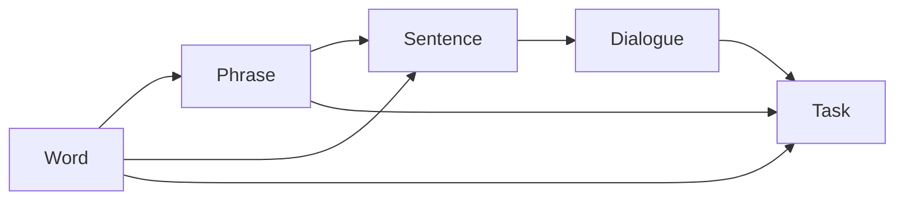

# Product Direction: Word-First, Notion-Inspired Language OS

> Status: Draft v0.1
> Owner: Josh
> Scope: Product vision + feature/ticket backlog. No implementation in this doc.

---

## 1. Vision

LinguistOS is a **word-first language workspace**. Where Notion's atomic unit is a *block*, ours is a **word**. Everything else — phrases, sentences, dialogues, tasks, decks, scenes — composes from words.

**Guiding principle:**
> Capture once at word-level, reuse everywhere at fluency-level.

A learner should never re-enter the same vocabulary in two places. A word added in a flashcard, encountered in a sentence, or saved from a video should refer to the **same canonical object**, with consistent properties, progress, and links.

---

## 2. Core Metaphor

| Notion | LinguistOS |
| --- | --- |
| Block | Word |
| Page | Phrase / Sentence / Dialogue |
| Database | Lexicon / Deck / Scene library |
| Synced block | Word reference (embed anywhere, updates everywhere) |
| Backlink | "Where have I seen this word?" |
| Slash command | Learning action (`/quiz`, `/cloze`, `/shadow`) |
| Template | Learning pack (Travel B1, Job interview, etc.) |
| View (table/board/calendar) | Lexicon view (table, flashcards, kanban-by-mastery, calendar-by-review) |

---

## 3. Atomic Composition Model

```
Word  ->  Phrase  ->  Sentence  ->  Dialogue / Scene  ->  Task
```

- **Word**: smallest unit. Has lemma, POS, frequency, CEFR, gender/conjugation class, audio, image, examples, tags.
- **Phrase**: a small group of words treated as one unit (collocations, idioms, fixed expressions, e.g. *"make a decision"*, *"strong coffee"*, *"il y a"*). First-class object, not a string.
- **Sentence**: composes words/phrases with grammar. Linked to source (lesson, video, mistake inbox).
- **Dialogue / Scene**: ordered set of sentences with speakers and context (cafe, interview, doctor).
- **Task**: a learning action over the above (review, produce, shadow, translate, roleplay).

**Mastery** is tracked per atom *and* per composition: knowing the word ≠ being able to use it in a spontaneous sentence.



---

## 4. Product Principles

1. **Word is the atom.** No duplicated lexical state across features.
2. **Composable, not modal.** Flashcards, writing, speaking, reading all reference the same lexicon.
3. **Database thinking.** Every learner artefact is queryable: properties, filters, formulas, views.
4. **Progressive disclosure.** Default view is simple; expand for morphology, etymology, collocations.
5. **Capture is cheap, reuse is automatic.** Errors, encounters, and saves all flow back into the word graph.
6. **Research-grade core, learner-grade surface.** The pipeline stays rigorous; the UI stays light.

---

## 5. Differentiators (vs Notion / Anki / Duolingo)

- Pronunciation scoring tied to the same word object.
- Morphology-aware suggestions (inflections, agreement, gender).
- Contextual difficulty adaptation per learner.
- LLM feedback grounded in the learner's word graph (e.g. "you overuse *very*; try these 5 alternatives you already know").
- Mistake inbox that auto-promotes errors into atoms.

---

## 6. Product Directions (Pick-One Framing)

| Direction | Scope | When to choose |
| --- | --- | --- |
| **Minimal** | Word Home + Lexicon DB + Flashcards + Sentence view | Thesis-first, ship fast, defend rigour |
| **Balanced** *(recommended)* | Minimal + Phrases + Mistake Inbox + Quick capture + 2-3 views + Templates | Strongest demo, manageable scope |
| **Ambitious** | Balanced + Scene Builder + Usage Graph + Pronunciation + LLM feedback | Stretch goal if time allows |

The ticket backlog below is tagged `[M]` Minimal, `[B]` Balanced, `[A]` Ambitious.

---

## 7. Epics

- **E1. Word Object & Lexicon DB**
- **E2. Phrase Object**
- **E3. Views & Database Thinking**
- **E4. Capture & Quick Actions**
- **E5. Composition: Sentences, Scenes, Tasks**
- **E6. Mistake Inbox & Auto-promotion**
- **E7. Templates & Packs**
- **E8. Backlinks & Usage Graph**
- **E9. Adaptive Review & Smart Queues**
- **E10. Production Skills (Writing/Speaking) — Ambitious**

---

## 8. Ticket Backlog

Format: `ID — Title [Tier] (Effort: S/M/L)`

### E1. Word Object & Lexicon DB

**LOS-101 — Canonical Word schema [M] (M)**
Define the single source of truth for a word.
- Fields: `lemma`, `surface_form`, `surface_forms[]`, `pos`, `language`, `cefr`, `frequency_rank`, `gender`, `conjugation_class`, `morph_features`, `ipa`, `audio_url`, `image_url`, `gloss_primary`, `glosses[]`, `tags[]`, `notes`, `created_at`, `last_seen_at`.
- Acceptance: schema documented; backend model + frontend type aligned; existing word records migrate without data loss.

**LOS-102 — Word Home page [M] (M)**
One canonical page per word.
- Sections: header (lemma + audio + image), properties panel, examples, related words, backlinks, history, and "Forms seen" (surface forms encountered over time).
- Acceptance: navigating to any word from any feature lands on the same page.

**LOS-103 — Word relations [B] (M)**
First-class relations: `synonym`, `antonym`, `derived_from`, `inflection_of`, `collocates_with`, `false_friend_of`.
- Acceptance: relations visible on Word Home and queryable in views.

**LOS-106 — Word Capture UX contract [M] (M)**
Capture fast, structure later.
- Required to save: only `surface_form` (what learner saw/heard). Translation is optional.
- Optional at capture time: translation, POS, tags, notes.
- AI enrichment is asynchronous: propose lemma, POS, gloss candidates, and morphology after save.
- Confidence policy: high confidence auto-fill; low confidence prompts user choice.
- Acceptance: median capture time under 3 seconds and no blocking modal requiring full metadata.

**LOS-107 — Lemma/surface preference mode [B] (S)**
Support both learner preferences without duplicating lexical state.
- User setting: `lemma_first` or `as_encountered`.
- Internally store both lemma and surface forms regardless of display preference.
- Acceptance: Word Home header respects preference while always exposing the counterpart form.

**LOS-104 — Inline word reference (synced block analogue) [B] (M)**
Embed a word anywhere; edits to the canonical word propagate.
- Acceptance: editing the lemma's audio updates every embedded reference.

**LOS-105 — Word import: CSV / paste / from text [M] (S)**
Bulk add words; auto-detect duplicates by lemma+language.

---

### E2. Phrase Object

**LOS-201 — Phrase schema [B] (M)**
Phrase = ordered list of word references + surface form + type (`collocation`, `idiom`, `fixed_expression`, `phrasal_verb`).
- Acceptance: phrases are not stored as plain strings; deleting a referenced word warns the user.

**LOS-202 — Phrase Home page [B] (S)**
Mirror of Word Home for phrases. Shows component words, examples, register, frequency.

**LOS-203 — Auto-suggest phrases from sentences [A] (M)**
When a sentence is added, suggest candidate phrases (n-grams above frequency threshold) for promotion to Phrase objects.

---

### E3. Views & Database Thinking

**LOS-301 — Lexicon table view with filters [M] (M)**
Sortable, filterable table of all words.
- Filters: POS, CEFR, tag, mastery, last reviewed, source.
- Acceptance: "show verbs I keep failing in past tense" is expressible.

**LOS-302 — Flashcard view [M] (S)**
Same data, card UI. Driven by current filter.

**LOS-303 — Kanban-by-mastery view [B] (S)**
Columns: New / Learning / Reviewing / Mastered. Drag to override.

**LOS-304 — Calendar-by-review view [B] (S)**
Words plotted on next-review date.

**LOS-305 — Saved views [B] (S)**
Persist filter+view combinations as named views (e.g. "High-frequency unknowns").

**LOS-306 — Formula property: urgency score [A] (M)**
`urgency = frequency * forgetting_risk * personal_relevance`. Configurable weights.

---

### E4. Capture & Quick Actions

**LOS-401 — Quick Capture modal + global shortcut [B] (M)**
Primary low-friction capture entrypoint.
- Trigger: primary CTA and keyboard shortcut (e.g. Cmd/Ctrl+K).
- Inputs: `surface_form` required; translation optional.
- Actions: create word, create phrase, create sentence.
- Acceptance: users can add a word from anywhere without navigating to a dedicated page.

**LOS-402 — Quick capture from selection [B] (S)**
Select text anywhere in app -> "Add as word/phrase/sentence". Auto-fills lemma, POS via NLP.

**LOS-403 — Slash command palette (optional) [A] (M)**
Optional advanced accelerator for power users.
- Global `/` menu inside text surfaces only.
- Commands: `/word`, `/phrase`, `/sentence`, `/quiz`, `/cloze`, `/shadow`, `/translate`, `/define`.
- Acceptance: commands remain non-blocking shortcuts, not required for core capture flow.

**LOS-404 — Browser/clip capture (stretch) [A] (L)**
External capture endpoint that creates atoms with source URL.

---

### E5. Composition: Sentences, Scenes, Tasks

**LOS-501 — Sentence object linked to atoms [M] (M)**
Sentence stores token-aligned references to Word/Phrase objects, plus source (lesson, video, mistake, generated).

**LOS-502 — Sentence generation tied to lexicon [M] (M)**
Generator can be constrained to use a subset of the user's lexicon (e.g. "use only words I know + 2 stretch words").

**LOS-503 — Scene Builder [A] (L)**
Drag words/phrases into a scenario template (cafe, interview). Outputs a Dialogue object usable in roleplay/shadowing.

**LOS-504 — Task object [B] (M)**
A reusable learning action over a set of atoms: review, produce, shadow, translate, cloze. Tasks have status, score, history.

---

### E6. Mistake Inbox & Auto-promotion

**LOS-601 — Mistake capture API [B] (M)**
Any feature (writing, speaking, quiz) can post a mistake: original, correction, atom refs, error type.

**LOS-602 — Mistake Inbox UI [B] (S)**
Triage view: accept (promote to atom + schedule review) / dismiss / merge.

**LOS-603 — Auto-promotion rules [A] (M)**
Rules: same lemma missed 3+ times -> auto-add to "weak words" tag and bump urgency.

---

### E7. Templates & Packs

**LOS-701 — Pack schema [B] (S)**
A Pack = curated set of words/phrases/sentences/tasks + metadata (level, theme, language).

**LOS-702 — Built-in packs [B] (M)**
Travel B1, Job interview, Doctor visit, Ordering food, Small talk.
- Acceptance: importing a pack does not duplicate words already in the user's lexicon — it links them.

**LOS-703 — User-created packs [A] (M)**
Save current filter or selection as a pack; export/import as JSON.

---

### E8. Backlinks & Usage Graph

**LOS-801 — Backlinks on Word/Phrase Home [B] (S)**
"Seen in: 4 sentences, 2 dialogues, 1 mistake."

**LOS-802 — Usage Graph view [A] (L)**
Visual network of related words/phrases (collocations, synonyms, co-occurrence). Click a node to open its Home.

---

### E9. Adaptive Review & Smart Queues

**LOS-901 — Per-atom mastery tracking [M] (M)**
Track recall strength, last reviewed, next due, source-of-truth shared across views.

**LOS-902 — Smart queue from query [B] (M)**
Build review session from a saved view (e.g. "verbs I fail in past tense"), not a static deck.

**LOS-903 — Composition-level mastery [A] (M)**
Separate metrics for *recognise* vs *produce* vs *use in spontaneous sentence*.

---

### E10. Production Skills (Ambitious)

**LOS-1001 — Pronunciation scoring on Word Home [A] (L)**
Record audio, get phoneme-level feedback, store in word history.

**LOS-1002 — Writing editor with grounded LLM feedback [A] (L)**
Editor that flags overuse, suggests alternatives drawn from the user's own lexicon, and proposes new atoms when the learner reaches.

**LOS-1003 — Morphology-aware corrections [A] (M)**
Corrections reference the morphology of the word object, not just surface text.

---

## 9. MVP Cut (Recommended)

Ship Balanced. MVP = all `[M]` plus the starred `[B]` items:

- LOS-101, 102, 105 (Word + Home + import)
- LOS-106 (capture contract: save with surface form only, enrich later)
- LOS-201, 202 (Phrase + Home)
- LOS-301, 302, 303, 305 (table, flashcards, kanban, saved views)
- LOS-401, 402 (quick capture modal + selection capture)
- LOS-501, 502 (sentence linked to atoms + constrained generation)
- LOS-601, 602 (mistake inbox)
- LOS-701, 702 (packs + a few built-ins)
- LOS-801 (backlinks)
- LOS-901, 902 (mastery + smart queue)

Defer: Scene Builder, Usage Graph, Pronunciation, LLM writing editor.

---

## 10. Open Questions

1. Are phrases versioned per learner, or shared across learners?
2. Does Sentence store full token alignment or just atom references?
3. Mastery: single scalar vs split (recognise/produce/use)?
4. How aggressive is auto-promotion from the Mistake Inbox?
5. Do we expose the database/formula layer to learners directly, or keep it as power-user surface?
6. Should AI auto-translation default to on for first-time users, or require explicit opt-in?
